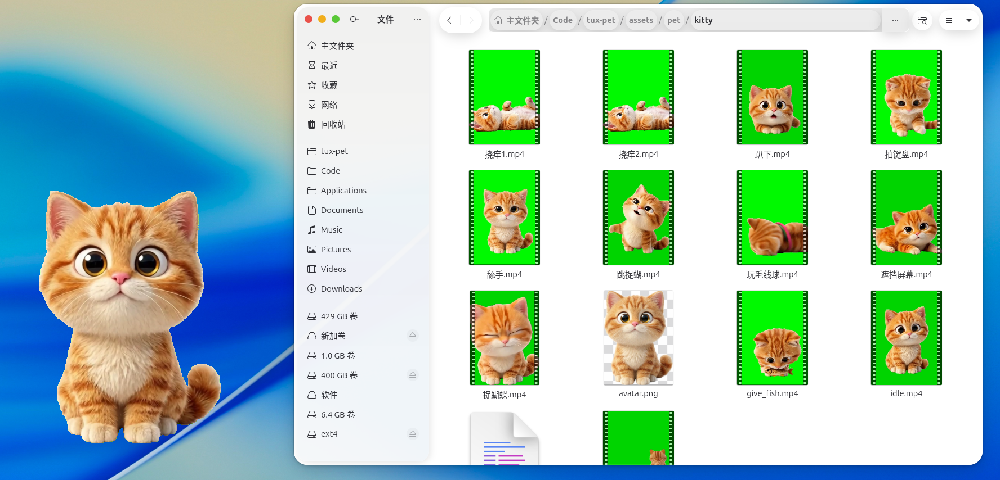
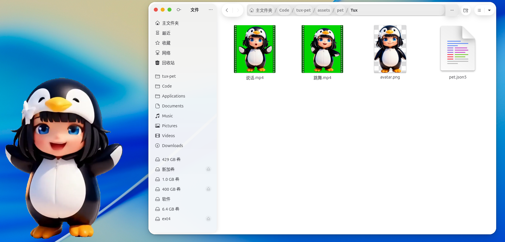

# tux-pet

Desktop pet overlay for Linux. Run animated cats on your desktop!





## Features

- **Multiple Characters** - Kitty, Cat, and Tux with unique animations
- **Smart Behaviors** - Pets get hungry, moody, and tired over time
- **Auto Animations** - Automatically switches between animations based on state
- **Desktop Aware** - Stays on the desktop, away from windows
- **Right-click Settings** - Easy character and animation switching
- **WebSocket Control** - Control via JSON API on port 9872

## Installation

### AppImage (Recommended)

Download from [GitHub Releases](https://github.com/tux-dot-fan/tux-pet/releases):

```bash
chmod +x tux-pet-*.AppImage
./tux-pet-*.AppImage
```

### Debian/Ubuntu

```bash
sudo dpkg -i tux-pet_*.deb
```

## Usage

Simply run the application. Right-click on the pet to:
- Switch characters
- Choose animations
- Adjust size
- Exit

### WebSocket API

Control via `127.0.0.1:9872`:

```json
{"character": "kitty", "animation": "idle", "base_scale": 1.0}
```

## Development

### Requirements

- Rust (stable)
- FFmpeg development libraries
- Cairo, Pango, FreeType

### Building

```bash
cargo build --release
make appimage  # AppImage
make deb       # Debian package
```

## License

MIT
